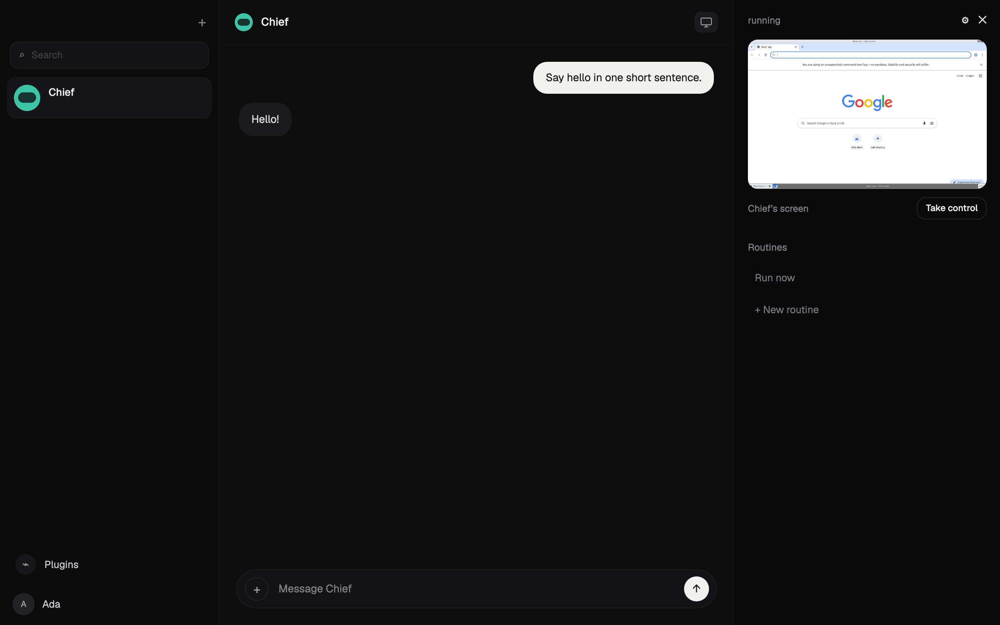

# Rakazo

Open-source Grok Bot alternative, built with Cursor and Grok 4.6.

Web, desktop, and mobile. Bring your own AI and sandbox. The product is still early (beta).

Each bot has one thread, one computer, memory, routines, and history. This repository is the complete core product — it runs without a Rakazo-operated control plane.

## Screenshots

<p align="center">
  
</p>

## Requirements

- Node.js 22+
- pnpm 9
- Docker Desktop (Postgres plus the graphical bot computer)

## Run locally (web)

From the repo root:

```bash
cp .env.example .env
```

Edit `.env`:

- Set `BETTER_AUTH_SECRET` and `ENCRYPTION_KEY` to long random strings.
- Put your OpenRouter key in `OPENROUTER_API_KEY` (or skip the key and paste one during onboarding).
- Optional: `COMPOSIO_API_KEY` if you want Plugins to talk to live apps.

Then:

```bash
docker compose -f infra/compose/docker-compose.yml up postgres -d
pnpm install
pnpm db:generate
pnpm db:migrate
pnpm sandbox:build
pnpm dev
```

`pnpm dev` starts the API (`:3100`), Graphile Worker, Vite web app (`:5173`), and sandbox supervisor (`:7091`).

Open [http://127.0.0.1:5173](http://127.0.0.1:5173). Sign up, pick a model from the Pi catalog (or Skip if the deployment key is set), create a bot, send a message. The computer pane is a live Linux desktop with a browser. Take control to sign in; the bot keeps that session after you release.

Confirm the product path:

```bash
curl -s http://127.0.0.1:3100/health
```

You want `"runtime":"pi"`, `"sandbox":"docker"`, `"wakeup":"graphile"`. `"composio":true` only if the Composio key is set.

Product defaults are Pi + Docker + Graphile. `pnpm verify:fast` pins the emulators (`AGENT_RUNTIME=scripted`, `SANDBOX_PROVIDER=fake`, `WAKEUP_DRIVER=memory`) so default tests never call live models or Composio.

If this Postgres was created with `prisma db push` before checked-in migrations existed, mark the baseline once:

```bash
pnpm --filter @rakazo/db exec prisma migrate resolve --applied 0001_init
```

## Run the desktop app

The Electron shell loads the same web UI. Leave `pnpm dev` running, then:

```bash
pnpm --filter @rakazo/desktop dev
```

Native red / yellow / green buttons close, minimize, and zoom that window. They do nothing in the browser tab. In the bot settings panel, **Grant folder** lets the desktop executor read a directory you pick. It will not upload the folder wholesale.

Point Electron at a different origin with `RAKAZO_WEB_URL` (default `http://127.0.0.1:5173`).

Packaged installers (optional):

```bash
pnpm --filter @rakazo/desktop pack
```

Outputs land in `apps/desktop/out/` (macOS dmg/zip, Windows NSIS, Linux AppImage). Those builds still need a running API and web origin.

## Verify

```bash
pnpm verify:fast       # unit, property, and in-process contract tests
pnpm verify            # Postgres via Testcontainers, emulators, API, Playwright
pnpm verify:providers  # optional live OpenRouter / E2B canaries
```

## Layout

```
apps/web api worker desktop mobile www
packages/core contracts db auth memory ui-web adapter-kit adapters testkit
infra/compose sandboxes
```

`apps/www` is the public marketing site (`rakazo.com`). It is not the signed-in product.

## Self-host and Cloud

See `docs/self-host.md`. Cloud and self-hosted editions share the same application and contracts. There is no separate Rakazo-hosted control plane in this repo yet — a public Cloud deploy is a VPS (or E2B) plus the marketing site, not a serverless push of the chat app.
