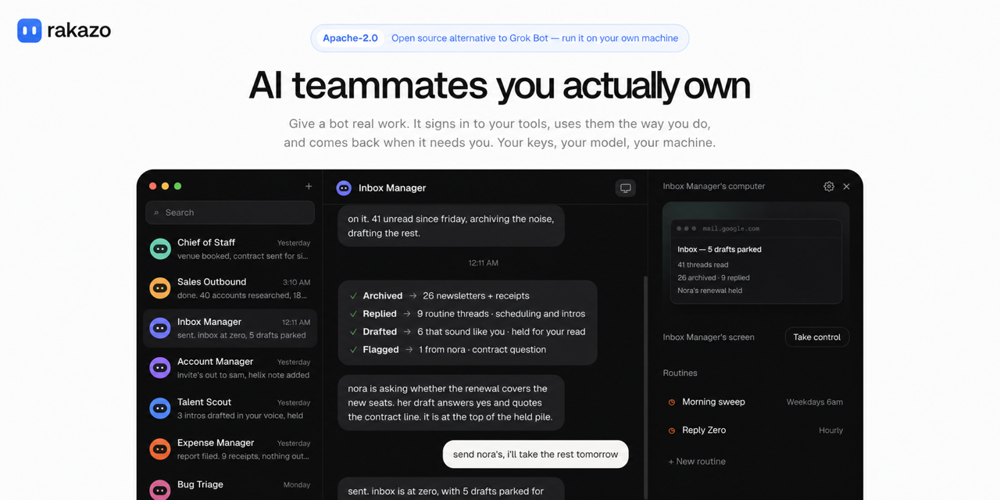

# autoSEO

[](https://github.com/elie222/rakazo/stargazers)
[](https://discord.gg/RWwKa2Sn7h)



autoSEO is an open-source platform for running persistent AI teammates. It is available on the web,
as an Electron desktop app, and through an Expo mobile app. Bring your own model and computer
provider, or run the complete stack locally.

autoSEO is in beta. Learn more at [rakazo.com](https://rakazo.com).

## Features

- Persistent bots with their own conversations, memory, routines, and history
- Voice mode: speak replies, dictate, and call a bot. Bring your own ElevenLabs, OpenAI, or Cartesia key
- Shared Team Computers and isolated Private computers
- Browser, terminal, file, and graphical desktop access
- Bots that can delegate to peer bots or short-lived subagents
- Bring-your-own model credentials through Pi
- App integrations through Composio or Pipedream Connect, plus user-installed Treg, remote MCP, and OpenAPI tool sources
- Docker, E2B, Daytona, and trusted local-computer support

## Demo

https://github.com/user-attachments/assets/dccdeddb-2134-4a56-8eed-b2e591736b1c

## Stack

- TypeScript
- React 19, Vite, and Tailwind CSS
- Electron and Expo
- Hono and oRPC
- PostgreSQL and Prisma
- Better Auth
- Graphile Worker
- Pi
- Docker, E2B, and Daytona
- Composio, Pipedream Connect, MCP, and OpenAPI integrations

## Quick start

You need Node.js 22+, pnpm 9, and Docker Desktop.

```bash
git clone https://github.com/elie222/rakazo.git
cd rakazo
cp .env.example .env
```

Set `BETTER_AUTH_SECRET` and `ENCRYPTION_KEY` in `.env` to independent, long random values. You can
also set `OPENROUTER_API_KEY`, or connect a supported model provider during onboarding.

Managed app catalogs are optional. Set `COMPOSIO_API_KEY` for Composio, or the
`PIPEDREAM_CLIENT_ID`, `PIPEDREAM_CLIENT_SECRET`, and `PIPEDREAM_PROJECT_ID` trio for Pipedream
Connect. Users can add an HTTPS MCP server, Treg endpoint, or OpenAPI JSON document from
**Integrations** without enabling either managed catalog. Connector credentials are encrypted on the
server and are never returned by the API.

Treg is usage-metered. Self-hosters supply their own Treg token; operators embedding Treg in a
hosted product should review [Treg's integration terms](https://treg.to/integrate.md), which require
a written agreement for hosted resale.

```bash
docker compose --env-file .env -f infra/compose/docker-compose.yml up postgres -d
pnpm install
pnpm db:generate
pnpm db:migrate
pnpm sandbox:build
pnpm dev
```

Open [http://127.0.0.1:5173](http://127.0.0.1:5173), create an account, connect a model, and create
your first bot.

For an agent-assisted installation, use [SETUP_PROMPT.md](./SETUP_PROMPT.md). For deployment,
provider selection, backups, and upgrades, see the [self-hosting guide](./docs/self-host.md).

## Desktop and mobile

The Electron and Expo apps are clients of the same autoSEO API used by the web app.

With the development stack running, launch Electron with:

```bash
pnpm --filter @rakazo/desktop dev
```

On first run the desktop app asks whether to use the autoSEO stack on this computer
(`http://127.0.0.1:5173`) or connect to an existing server. Public servers must use HTTPS; HTTP is
accepted only for loopback and private LAN addresses (not link-local). The app verifies autoSEO's
health endpoint before saving, and later launches go straight to that instance.

Use **Change autoSEO Server…** in the application menu to reconnect. Closing that window without
saving returns to the previous instance. For development automation, set `RAKAZO_WEB_URL` to point
the shell somewhere else without changing the saved instance, or `RAKAZO_FORCE_SETUP=1` to run
setup again.

Mobile build and release instructions live in [docs/mobile-release.md](./docs/mobile-release.md).

## Development

autoSEO is a TypeScript monorepo built with React, Electron, Expo, Hono, Postgres, Prisma, Graphile
Worker, and Pi.

```text
apps/       web, api, worker, desktop, mobile, and public website
packages/   domain, contracts, persistence, adapters, UI, and test tooling
infra/      local services and computer images
docs/       architecture, operations, and release guides
```

Common checks:

```bash
pnpm lint
pnpm check
pnpm test
pnpm test:integration
pnpm test:e2e
```

See [CONTRIBUTING.md](./CONTRIBUTING.md) for the development workflow and test matrix.

## Documentation

```bash
pnpm test              # unit, property, and in-process contract tests
pnpm test:integration  # Postgres journeys, Graphile jobs, LISTEN/NOTIFY
pnpm test:e2e          # Playwright against the emulated stack
pnpm test:e2e -- --sandbox=e2b # the same deterministic suite against real E2B
pnpm test:e2e -- --sandbox=daytona # the same suite against real Daytona
pnpm test:e2e -- --sandbox=box # the same suite against real Box
pnpm test:topology     # local Docker + Graphile worker recovery (needs Docker)
pnpm test:canary       # live OpenRouter / E2B / Box canaries
# explicit real vision-model + real E2B desktop acceptance test:
COMPUTER_E2E_MODEL=<vision-capable-openrouter-model-id> pnpm test:computer
```

- [Self-hosting](./docs/self-host.md)
- [Computer runtime and isolation](./docs/computer-runtime.md)
- [Mobile releases](./docs/mobile-release.md)
- [Performance testing](./docs/performance.md)

## Link Builder

Link Builder is the weekday forum workflow inside this repo. A customer creates a project, fills the
wizard, and clicks **Start building**. The worker then posts from a persona browser. The dashboard
does not show a legal warning banner; the terms are in [PRODUCT.md](./PRODUCT.md).

Customer setup, in wizard order:

1. Project: brand name and allowed domains.
2. Markets: country, locale, and timezone for each market.
3. Persona: display name, language, and register.
4. Captell token: paste it once. It is stored in the encrypted secret store and is not returned by the API.
5. Proxy: an endpoint template. IPRoyal is the first preset, Oxylabs the second. Until a deployment sets a host, the placeholder is `proxy.example`.
6. Mailbox: set `AGENTMAIL_API_KEY` to provision a real inbox. Without it, the address is `lb-<projectId>@inbox.example`.
7. Disclosure: the default is `undisclosed_persona`.
8. Start: clicking **Start building** records `responsibilityAck` for that project.
9. Schedule: weekdays, inside the project's window.

The persona browser runs in the computer sandbox (Docker locally, Daytona or E2B when that provider
is selected). The sandbox image is expected to provide Node.js, Chromium at `/usr/bin/chromium`,
`rakazo-lb-browser` on `PATH`, and a display the operator live screen can attach to. That image
expectation has not been checked against a live Daytona or E2B sandbox.

Kernel is optional. Set `LINK_BUILDER_BROWSER=kernel` and `LINK_BUILDER_KERNEL_SECRET_ID` to a
secret id in the encrypted store. The adapter speaks HTTPS with an injected fetch and is not
constructed otherwise. It does not upload extension zips; name extensions already stored in the
Kernel project with `LINK_BUILDER_KERNEL_EXTENSION`. CI does not call Kernel.

Plan limits in v1 come from a static `starter` stub (`projects` 3, `live_per_day` 10, `personas` 3).
There is no Stripe SDK and no billing webhook. The link-builder API allows 120 requests per minute
per workspace in each API process.

Harold still runs these live canaries separately: Captell, two-board identity, the sandbox browser,
AgentMail inbound, and an https webhook. This tree does not record their results.

## Contributing

The Playwright workflow can also be started manually with **Sandbox provider** set to `e2b`, `daytona`, or `box`.
Those options require `E2B_API_KEY`, `DAYTONA_API_KEY`, or `BOX_API_KEY`, keep the deterministic scripted agent runtime, and destroy
the provider machines after the run. The default and all automatic runs remain on `fake`.
Contributions are welcome. Please read [CONTRIBUTING.md](./CONTRIBUTING.md) before opening a pull
request. For security vulnerabilities, follow [SECURITY.md](./SECURITY.md) instead of filing a public
issue.

autoSEO is licensed under the [Apache License 2.0](./LICENSE).

Questions and ideas are welcome in the [autoSEO Discord community](https://discord.gg/RWwKa2Sn7h).
